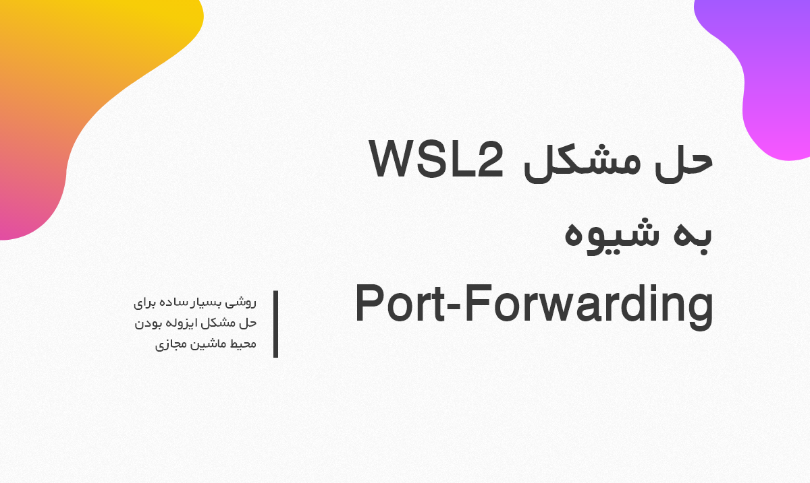
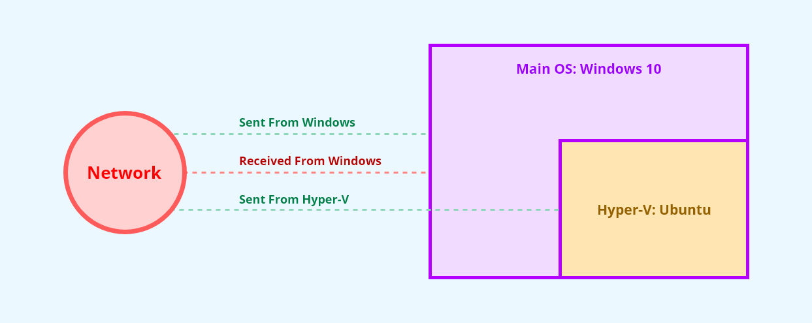
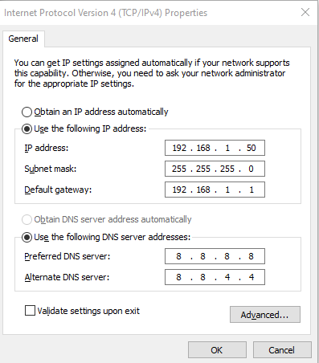
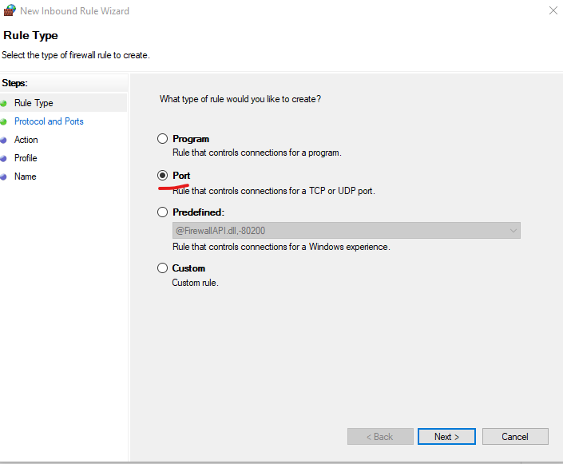
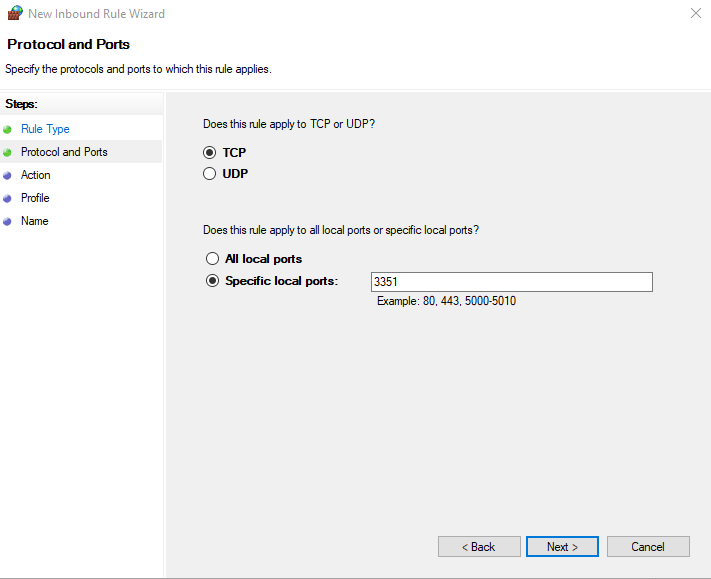
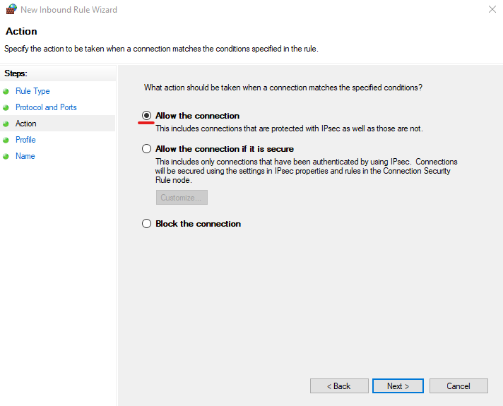

<div dir="rtl">

# حل مشکل WSL2 به شیوه Port-Forwarding



## مقدمه

دوباره سلام، شاید بگید این بنده خدا چرا اینقدر گیر داده به WSL2 یا همون لینوکس ویندوز 10 که من اسمش رو گذاشتم

واقعیتش این هست که وقتی میبینم مطلبی ناقص و یا به درستی به کسی انتقال نمیدم دچار عذاب وجدان میشم و هر چه سریعتر باید اون مطلب رو درست کنم تا بتونم شب با آرامش بخوابم

من در در [بخش دوم](https://github.com/illustrayking/howToSolveWSLIssue) مطلبی مفصل رو منتشر کردم در مورد روش **ابداعی** خودم که چطور تونستم مشکل WSL2 رو حل کنم اما دوستان عزیزم لطف کردم و این مطلب رو خوندن و به دستم انتقاداتی رو رسوندن

در مبحث قبل مشکل به طور کامل حل شد اما این شیوه پیچیدگی ها و دردسرهای خودش رو ایجاد میکنه

1- روش ابداعی من پیچیدگی زیادی رو داره و باید با محیط هایی همچون powershell آشنایی مناسبی رو داشته باشید

2- در این روش شبکه به شدت بهم میریزه و از روش نامتعارف جلوی فشارهای ویندوز رو میگرفتیم که این باعث کندی در شبکه و حتی در بعضی موارد مشکلاتی رو هم ایجاد میکرد

3- امنیت تا حدودی پایین میومد به علت اینکه فلسفه ایزوله بودن به کل از بین میرفت

## اما چطور میخواهیم در این روش مشکل رو حل کنیم؟

اول بگم که این روش به شدت آسون هست و شاید فقط 5 دقیقه از زمان شما رو بگیره

در این روش ما میخواهیم از شیوه ارسال از طریق پورت استفاده کنیم

پورت ها یکی از دوستان قدیمی دنیای نت هست که هنوز با قدرت به کار خودش ادامه میده و ما میخواهیم از این طریق بدون اینکه محیط ایزوله اوبونتو رو به خطر بندازیم تمام رد و بدل ها رو به بیرون انجام بدیم

قبلا هم در مورد این موضوع مفصل صحبت کردیم که چرا `WSL` این مشکل آزاردهنده رو داره

اما باید بگیم که این یک مشکل نیست بلکه طبیعت یک ماشین مجازی هست که محیطش ایزوله هست و ما از طریق شیوه هایی  همچون `Bridge mode` و یا `Port-Forwarding` را رو برای ارتباط به بیرون رو ایجاد میکنیم

به طور کلی WSL به راحتی میتونه با بیرون ارتباط برقرار کنه و ما در اینجا هیچ مشکلی نداریم اما مشکل از جایی شروع میشه که هیچ کس از بیرون نمیتونه ارتباطی با WSL داشته باشه

به شکل زیر توجه کنید



در تصویر بالا همونطور که شرح دادم ویندوز که سیستم عامل اصلی هست با network خودش تماما در حال `send,receive`  هست

اما اگر دقت کنید `Hyper-v` من فقط ارسال رو انجام میده اما چیزی از محیط `Network` دریافت نمیکنه به علت طبیعت ایزوله بودن ماشین مجازی

اما ما میخواهیم مثل تصویر زیر بدون اینکه به دردسرها و پیچیدگی های مطلب قدیم من بخوریم مشکل رو حل کنیم

مشکل به شیوه یک بازی قدیمی که بچه ها انجام میدادن حل میشه

یعنی بازی **بغلی بگیر**

این بازی به اینصورت بود که میگفت **بغلی بگیر، چیو بگیرم، سنگو بگیر، چیکارش کنم؟، بده به بغلی**

ما هم میخواهیم ویندوز دقیقا برای ما همینکارو بکنه یعنی من اون رو بدم بهش بعد ویندوز بگه خب چیکارش کنم بهش بگم بده بره به اوبونتو به همین سادگی

ابتدا اینکار رو میخواهیم با `ssh` انجام بدیم

اول از همه من به ویندوز خودم یک آی پی کاملا استاتیک میدم

اینکار ور میتونید با رفتن به بخش زیر انجام بدید

<div dir="ltr">

```
start -----> settings ----> Network & Internet ----> Change Adapter Options ----> Ethernet Or Wifi
```
</div>

سپس بر روی کانکشن مورد نظر کلیک راست کرده و بر روی `Properties` کلیک کنید سپس به بخش `Internet Protocol Version 4` میروید و آی پی و دی ان اس مورد نظر خودتون رو میدید به شکل زیر




ابتدا وارد WSL شده و یک فایل به نام `run.sh` در مکانی که میخواهید ایجاد کنید و توسط `nano` باز کنید

به شکل زیر

<div dir="ltr">

```
sudo nano /path_to/run.sh
```
</div>

خب حالا دستورات زیر رو قدم به قدم به فایل مورد نظر اضافه میکنیم

ابتدا نیاز داریم که آی پی اوبونتو رو بگیریم، به علت اینکه آی پی `WSL` داینامیک هست ما باید توسط یک دستور این آی پی رو بگیریم

ابتدا یک متغیر ایجاد میکنیم و مقدار WSL رو درون یک متغیر ذخیره میکنیم

<div dir="ltr">

```
WSL= $(hostname -I | awk '{print $1}')
```
</div>

در این روش یک متغیر به نام `WSL` میسازیم و توسط دستور  `wsl hostname -I` آی پی اوبونتو رو `Pipe` میکنیم به متغیر که در شیوه بالا میتونید ببینید


خب حالا کار اصلی ما انجام میشه اگر با دستور `echo` آشنا باشید میدونید که این دستور کارش این هست که در مکانی که من میگم مقدار مورد نظر من رو پرینت میگیره

خب من هم بهش میگم برو این دستور رو در یک فایل به نام `run.ps1` پرینت بگیر که من نیازش دارم

پس مینویسیم

<div dir="ltr">

```
echo "netsh int portproxy reset all; netsh interface portproxy add v4tov4 listenport= <your ideal Port> listenaddress= <windows ip address> connectport=<your application port> connectaddress=$WSL" > /path_to/run.ps1
```
</div>

 توسط دستور بعدی میام تمام پورت ها رو به حالت اول برمیگردونم یعنی توسط دستور `netsh int network portproxy reset all` اینطوری مطمئن میشم که دستور قبلی رو پاک کرده، به علت اینکه آی پی داینامیک هست باید آی پی قبلی پاک بشه

سپس دستور اصلی آخرین دستور می باشد

در این دستور به بهمون صورت که گفتم میخواهیم به طور مثال به اوبونتو خودمون ssh کنیم

خب با چه آی پی اون کار رو میکنیم؟ یعنی با همون آی پی که به ویندوز 10 دادیم

پس به چند چیز نیاز داریم

1- آی پی ویندوز

2- یک پورت دلخواه مثلا 3351

3- پورتی رو که برای ssh توی اوبونتو در نظر گرفتیم

ابتدا پورت `ssh` رو پیدا میکنیم

کافی هست درون اوبونتو بنویسیم

<div dir="ltr">

```
cat /etc/ssh/sshd_config | grep "Port"
```
</div>

خب حالا ما پورت ssh رو داریم 

پس مقدارها رو جایگزین میکنیم

به جای `your ideal port` همون پورتی رو که میخواهیم باز کنیم رو مینویسیم به طور مثال 3351

به جای `windows ip address` آی پی که به ویندوز دادیم رو مینویسیم

و به جای `your application port` پورت ssh رو مینویسیم

پس به طور مثال میشه

<div dir="ltr">

```
netsh interface portproxy add v4tov4 listenport=3351 listenaddress=192.168.1.50 connectport=22 connectaddress=$WSL
```
</div>

خب 90 درصد کار ما به اتمام رسید


حالا در خط بعد مینویسیم

<div dir="ltr">

```
powershell.exe "/path_to/run.ps1"
```
</div>

خب در دستورات قبل توسط echo یک فایل به نام `run.ps1` ایجاد کردیم و به دستور بالایی آدرس اون فایل رو میدیم و با کلید ترکیبی `Ctrl + x` و با فشردن `y` فایل رو در مکان مورد نظر سیو میکنیم

حالا ما میخواهیم که هر وقت اوبونتو رو باز کردیم این فایل اجرا بشه پس کافی هست درون یکی از این فایل ها به نام `.bashrc` و یا `.zshrc` دستور زیر رو بنویسیم

<div dir="ltr">

```
bash /path_to/run.sh
```
</div>

حالا هر وقت که اوبونتو من بیاد بالا خودش اتوماتیک آی پی میگیره و پورت رو هم باز میکنه

اما اگر شما به اخطار زیر مواجه شدید که بهتون میگه دستور باید تحت `run as administrator` باشه کافی هست که فقط WSL رو تحت `run as administrator` باز کنید که مشکل حل بشه

حالا هر وقتی که درون هر سیستمی من بخوام ssh کنم به اوبونتو مینویسیم

<div dir="ltr">

```
ssh -p <your ideal port> username@windows_ip

for example

ssh -p 3351 numeric@192.168.1.50
```
</div>

حالا هر وقت که من به این آی پی دستور بدم اون رو `Forward` میکنه به پورت `22` که در دستور بالا بهش گفتم و کار ما کلا تموم میشه

## چگونه پورتی رو درون فایروال ویندوز باز کنیم

کافی هست `run` رو باز کرده و نوشته `firewall.cpl` سپس اینتر کنید و وارد بخش `advanced setting` میشیم

سپس در بخش `inbound rules` وارد میشیم و در سمت راست بر روی `new rule` کلیک میکنیم

صفحه ای باز میشه و بر روی `port` کلیک میکنیم و پورت مورد نظر رو بهش میدیم



سپس پورت مورد نظری رو که میخواهیم از بیرون از آن استفاده کنیم رو باز میکنیم که در اینجا پورت 3351 هست



و در نهایت به بخش بعد رفته و بر روی `Allow the connection` رو کلیک میکنیم



و سپس به `outbound rule` رفته و دقیقا مانند روش بالا به همین شیوه پورت رو باز میکنیم

به این شیوه ما میتونیم به راحتی هر چه تمام مشکل آزاردهئده تمام ماشین مجازی ها و بعلاوه WSL رو حل کنیم
</div>